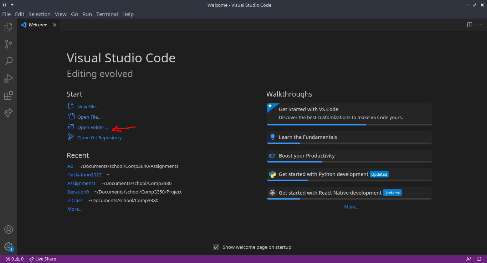
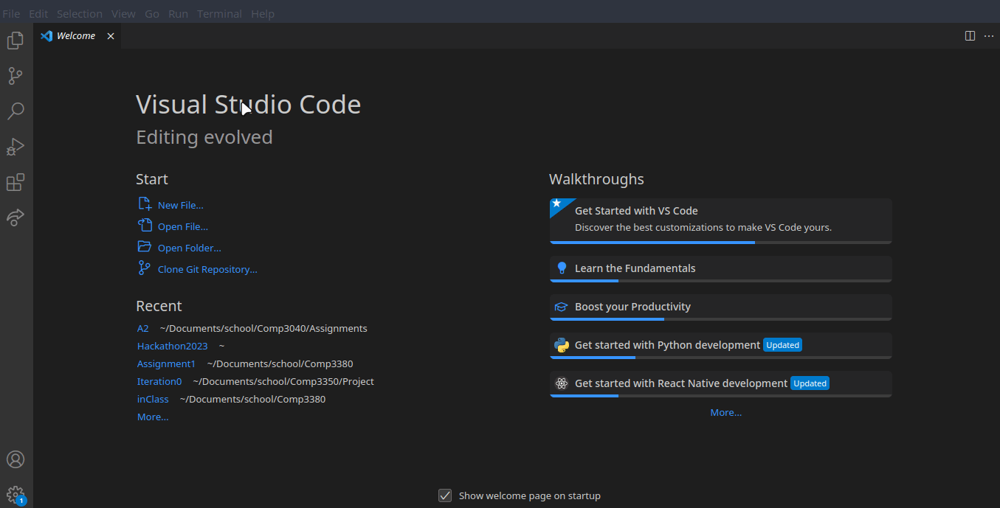
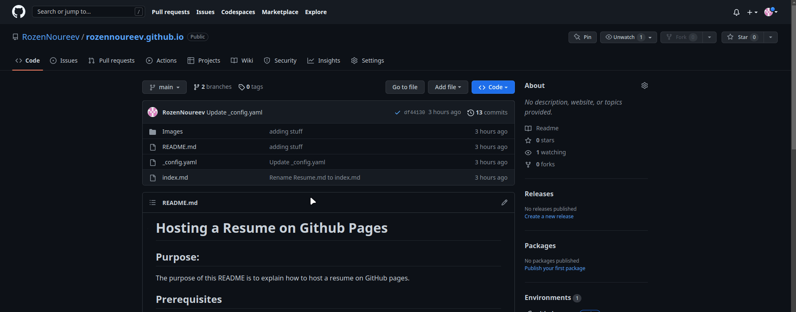
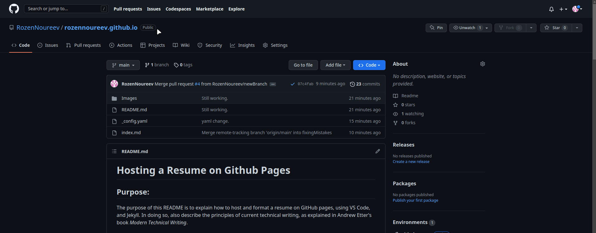

# Hosting a Resume on Github Pages

## Purpose:
The purpose of this README is to explain how to host and format a resume on GitHub pages using VS Code and Jekyll. In doing so, also describe the principles of current technical writing, as explained in Andrew Etter's book _Modern Technical Writing_.

## Prerequisites

To host a resume on GitHub you will need the following:

* A resume written in Markdown(See More Resources for a Markdown guide) and saved in its own folder on your machine. Writing your resume in Markdown allows you to write freely without wasting your time going through all the settings and picking out all the formatting options you like. Markdown lets you quickly format your document to different file types, whether you need it as a pdf, HTML, etc.
* Have git installed on your machine. (For instructions see More Resources)
* A GitHub account to create a repository and host your resume.
* VS Code installed. (See More Resources)
* A README file, also written in Markdown. (Optional but good practice)
* We will be using Jekyll to generate your resume into a pretty website. For the purposes of these instructions, we will be using a template that is supported by GitHub pages. You can find a list of supported templates in the More Resources section. 

## Instructions

We will assume you already have a resume written in Markdown. While most of the following steps can be followed on any computer, I am using Linux, therefore, any terminal commands may be different if you are on a mac or windows system.

1. Create a GitHub account (If you already have an account skip this step). GitHub is a version control system that will allow you to access your resume from anywhere with an internet connection, and edit it without needing to have your resume saved on some sort of hardware such as a thumb drive. Github also provides a platform from where you can host your resume as a static website.
    1. Navigate to [github.com](https://github.com/)
    2. Click the 'Sign up' button at the top right corner of the page. 
    3. Follow the steps provided, filling out the required information.
2. Sign in, and create a new repository. 
    1. Click on the little plus sign in the top right corner. This will produce a drop-down menu. 
    2. Select create a new repository. 
    3. Give your new repository a name. I suggest you name it [your-GitHub-Username].github.io. This will let GitHub know that you want this repository to be created into a website using Github pages.
    4. You can go through the rest of the settings for the repository if you wish, but for now, this is unnecessary. You can leave the default settings. 
    5. Scroll to the bottom and select "Create Repository".
    6. These steps can be seen in the following gif. 
3. Open VS Code.
4. Open the folder containing your resume in VS Code.
      
5. Make sure your resume is saved as _index.md_.
6. Create a new file. Save it as _\_config.yaml_. This file will inform Jekyll and GitHub which theme template your website should follow.
    1. Go to the [supported themes website](https://pages.github.com/themes/).
    2. Pick a theme that you like by clicking on the links provided and finding the preview in the README of the corresponding GitHub repository. (For these instructions, I will use the cayman theme.)
    3. Scroll down to the usage section of the README in the template's repository. There will be a couple lines of code to add to your _\_config.yaml_. For the cayman theme I am using, the code looks like this:  
    > remote_theme: pages-themes/cayman@v0.2.0  
    > plugins:  
    > \- jekyll-remote-theme  
    4. Copy and paste that into your config file.
7. Initialize your local directory as a git directory. 
    1. Open a terminal by pressing the `ctrl`, `shift`, and ` keys on your keyboard. Alternatively, you can find the terminal drop-down, and select new terminal at the top bar of VS Code as follows. (You can also open a terminal separately from VS Code, but make sure you change directories into the directory with your resume and config files.)
    2. In the terminal, type in `git init`. This will initialize the git repository. 
8. Connect your local git repository to the GitHub repository. 
    1. Go to your GitHub repository and find the link for the repository. Since you made a new repository, it might have all the steps and link you need in the middle of the page. Alternitevly, press the blue  button that says <>Code which will open a drop down where it will have the link to the repository. The link should follow the following format: `https://github.com/[yourGitHubUsername]/[theRepositoryName]`. 
    2. Go back to the terminal and type in `git remote add origin` followed by the link you just copied. Reminder that you cannot do ctrl+v in order to paste in the terminal. Instead use ctrl+shift+v.
9. Push your files to GitHub. You can do this using the source control panel on the left side of VS code. Click the commit button. Press the  three dots above. This will open a drop down menu, where you can select the push command. Then VS Code will do the work for you, or you can do this using the terminal and the following the steps described below.
    1. Type the following command into your terminal: `git add --all`. This will inform git that you want to push all the files in the directory.
    2. Type in the following command: `git commit -m "initial commit"`. You can replace initial commit with any other message you wish. The message will allow you to easily identify what you did for that specific commit if you ever need to go back and look through your commit history.
    3. Push your files to github using the following command: `git push --set-upstream origin main`. The set upstream portion of the command tells git to push your files to the main branch. Currently, 'main' is the name of the default branch, though sometimes the default might be 'master', in which case change 'main' in the command to 'master'.
10. Navigate back to your GitHub page. You should be able to see the files that you just uploaded. If you created a README, you should be able to see it written out below.
11. Publish your page. 
    1. Navigate to the settings tab. 
    2. Go to the 'Pages' Section. 
    3. Select 'Deploy from branch' in the Source drop-down. 
    4. Select 'main' (or master, whatever the branch is called in your repository) and the '/(root)' options in the branch section.
    5. Navigate back to the 'Code' tab. There you will see a yellow dot or a blue checkmark. The yellow dot means your page is publishing, checkmark means it is published
    
12. You are Done! You can now open your website. You can find the link in the pages section of the settings tab.  

## More Resources

* [Markdown guide](https://www.markdownguide.org/)
* [Jekyll themes](https://pages.github.com/themes/)
* [Git installation instructions](https://git-scm.com/book/en/v2/Getting-Started-Installing-Git)
* [Modern Technical Writing - Andre Etter](https://www.amazon.ca/Modern-Technical-Writing-Introduction-Documentation-ebook/dp/B01A2QL9SS/ref=sr_1_1?keywords=modern+technical+writing&qid=1678427403&sprefix=modern+technical+%2Caps%2C548&sr=8-1)
* [VS Code](https://code.visualstudio.com/)
* [Jekyll documentations](https://jekyllrb.com/)

## Authors and Acknowledgements

* Rozen Noureev
* Thank you to Andrew Etter, and his marvelous book _Modern Technical Writing_
* Thank you to Stewart Wilcox, for staying past the end of class helping me. 
* Thank you to the 10+ contributers of the Cayman theme. 

## FAQs

- Why not use a word processor? I don't need to learn any new "languages".
    - Markdown allows you to save time by not needing to play with the format settings. Also, in situations where you work as a team, it makes it easier for everyone to contribute to a single file.
- Why is my resume not showing up?
    - This could be caused by many things. Start by checking the build status of the GitHub page.